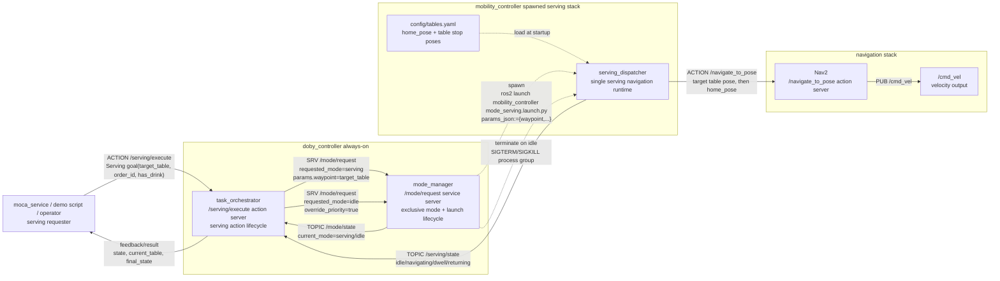
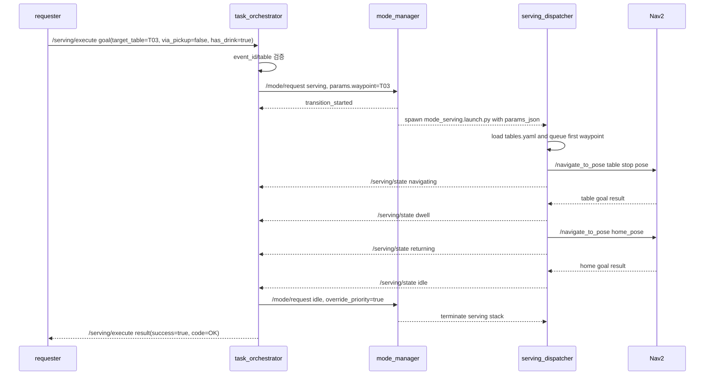

# doby_controller 서빙 시연 rqt graph

> 기준 소스: `src/controller/doby_controller`, `src/controller/mobility_controller`  
> 목적: 현재 구현된 서빙 기능을 안정적으로 시연하기 위한 최소 ROS 구조를 정의한다.  
> 주의: 이 문서는 코드 변경 없이 rqt graph/운용 구조만 정리한다.

## 핵심 구조

서빙 시연의 성공 기준은 `moca_service` 또는 operator가 테이블 하나를 요청하면 로봇이 해당 테이블로 이동하고, dwell 후 home으로 복귀한 뒤 `/serving/execute` action result를 받는 것이다.

그래프는 이 경로만 1차 구조로 둔다.

1. 외부 요청은 `/serving/execute` action 하나로 들어온다.
2. `task_orchestrator`는 action lifecycle, 요청 검증, feedback/result, 완료 후 idle 복귀 요청만 맡는다.
3. `mode_manager`는 `/mode/request`를 받아 `serving` 모드 stack을 spawn/kill하는 프로세스 생명주기만 맡는다.
4. `serving_dispatcher`는 launch param의 첫 `waypoint`를 읽고 Nav2에 테이블 이동과 home 복귀 goal을 보낸다.
5. Nav2만 실제 속도 명령을 만든다. 서빙 노드는 `/cmd_vel`을 직접 발행하지 않는다.

`/task/request_serving` service와 `RequestServing.srv`는 제거된 구조로 본다. 시연/연동/테스트 모두 `/serving/execute` action을 사용한다.

## 개선된 serving rqt graph



## 시연 시퀀스



## 핵심 인터페이스

| 구분 | 이름 | 타입 | 연결 | 시연 역할 |
|---|---|---|---|---|
| Action | `/serving/execute` | `dobi_npc_msgs/action/Serving` | external client -> `task_orchestrator` | 서빙 작업의 유일한 외부 진입점 |
| Service | `/mode/request` | `dobi_npc_msgs/srv/SetMode` | `task_orchestrator` -> `mode_manager` | `serving` 진입, 완료 후 `idle` 복귀 |
| Topic | `/mode/state` | `dobi_npc_msgs/msg/ModeState` | `mode_manager` -> `task_orchestrator` | 현재 모드 관찰과 action 완료 판단 보조 |
| Launch param | `params_json.waypoint` | JSON string | `mode_manager` -> `mode_serving.launch.py` -> `serving_dispatcher` | 첫 목표 테이블 전달 |
| Config | `tables.yaml` | YAML | `serving_dispatcher` load | 테이블 정차 위치와 home pose의 source of truth |
| Topic | `/serving/state` | `std_msgs/msg/String` JSON | `serving_dispatcher` -> `task_orchestrator` | action feedback/result와 완료 dwell 판단 |
| Action | `/navigate_to_pose` | `nav2_msgs/action/NavigateToPose` | `serving_dispatcher` -> Nav2 | 테이블 이동과 home 복귀 |
| Topic | `/cmd_vel` | `geometry_msgs/msg/Twist` | Nav2 -> robot base pipeline | 실제 로봇 속도 출력 |

## `Serving` goal

시연에서는 아래 필드만 핵심이다.

| 필드 | 시연 기준 |
|---|---|
| `event_id` | 중복 요청 방지 키. 매 요청마다 고유해야 한다. |
| `order_id` | 외부 주문 추적용. 비워도 주행은 가능하다. |
| `target_table` | `T01` ~ `T05` 중 하나. `tables.yaml`에 좌표가 있어야 한다. |
| `has_drink` | 현재 로봇이 음료를 들고 있다는 시연 상태. 보통 `true`. |
| `via_pickup` | 현재 pickup helper가 비활성화되어 있으므로 핵심 주행 시연에서는 `false`를 권장한다. |
| `drink_id` | 추적용 메타데이터. 주행 판단에는 사용하지 않는다. |

예시:

```bash
ros2 action send_goal /serving/execute dobi_npc_msgs/action/Serving \
"{event_id: 'demo-serving-001', drink_id: 'D-demo', order_id: 'O-demo', target_table: 'T03', via_pickup: false, has_drink: true}"
```

## `/serving/state` JSON

`serving_dispatcher`는 1Hz로 상태를 발행한다. `task_orchestrator`는 `navigating`, `dwell`, `returning` 중 하나를 본 뒤 `idle`을 받으면 실제 서빙 주행이 끝난 것으로 판단한다.

```json
{
  "state": "idle | navigating | dwell | returning",
  "current_table": "T01 | T02 | ... | __home__ | null",
  "queue": [],
  "dwell_sec": 5.0,
  "return_home": true,
  "home_registered": true
}
```

## 시연 전/중 확인

```bash
ros2 action list | grep -E '^/serving/execute$'
ros2 service list | grep -E '^/mode/request$'
ros2 action list | grep -E '^/navigate_to_pose$'
```

`/serving/state`는 `mode_manager`가 `serving_dispatcher`를 띄운 뒤부터 발행된다. 시연 중 별도 터미널에서 확인한다.

```bash
ros2 topic echo /serving/state
```

정상 시나리오의 관찰 순서는 다음과 같다.

```text
/mode/state: idle -> serving -> idle
/serving/state: idle -> navigating -> dwell -> returning -> idle
/serving/execute result: success=true, code=OK
```

## 의도적으로 그래프 밖으로 뺀 항목

아래 항목은 현재 코드에 남아 있거나 운영 편의에는 쓸 수 있지만, 핵심 서빙 시연 rqt graph에는 넣지 않는다.

| 항목 | 그래프에서 뺀 이유 |
|---|---|
| `/serving/goto_table` | serving 모드가 이미 떠 있을 때 추가 테이블을 큐에 넣는 확장 경로다. 단일 주문 시연의 진입점은 `params_json.waypoint`다. |
| `/serving/reload_tables` | 좌표 보정용 운영 서비스다. 시연 path의 필수 통신이 아니다. |
| `/serving/active_goal_marker` | RViz 시각화용 marker다. 주행 제어/완료 판단에 필요 없다. |
| `/doby/event` | 운영 로그용 이벤트다. action result와 `/serving/state`만으로 핵심 시연 검증이 가능하다. |
| `/battery_state`, `/rapport/event`, `/operator/command` | `mode_manager` guard 입력이다. 안전/운영 레이어에 남기되 serving 시연 그래프의 주 흐름에는 섞지 않는다. |
| pickup/serve arm action helper | 현재 `task_orchestrator`에서 임시 비활성화되어 즉시 성공 처리된다. 주행 시연에서는 `via_pickup:false`로 범위를 명확히 한다. |
| patrol/guiding/table occupancy 관련 topic/service | 다른 모드의 기능이다. 서빙 단일 시나리오 검증에서 제외한다. |

## 코드 위치

| 역할 | 파일 |
|---|---|
| serving action orchestration | `src/controller/doby_controller/src/dobi_npc/dobi_npc_bringup/dobi_npc_bringup/task_orchestrator_node.py` |
| mode FSM + launch supervisor | `src/controller/doby_controller/src/dobi_npc/dobi_npc_bringup/dobi_npc_bringup/mode_manager_node.py` |
| serving action definition | `src/controller/doby_controller/src/dobi_npc/dobi_npc_msgs/action/Serving.action` |
| serving launch | `src/controller/mobility_controller/mobility_controller/launch/mode_serving.launch.py` |
| serving dispatcher | `src/controller/mobility_controller/mobility_controller/scripts/serving_dispatcher_node.py` |
| table/home poses | `src/controller/mobility_controller/mobility_controller/config/tables.yaml` |
